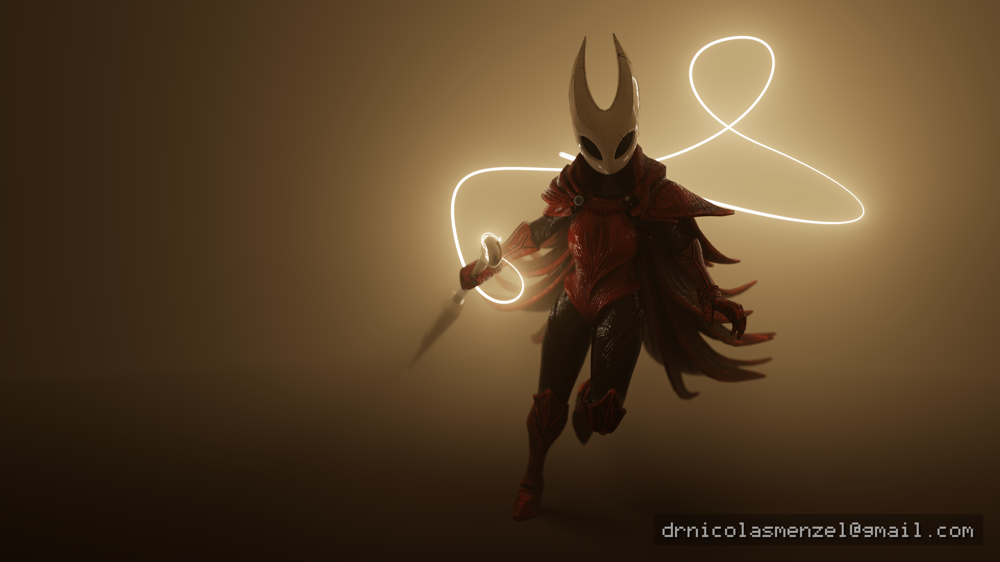

# Portfolio — Path-Traced Renders

Hero renders produced with my own, self-written path tracers. This repo doubles
as a small gallery site.

---

## Renders

<table>
  <tr>
    <td width="50%"> <b>Bistro — Café</b></td>
    <td width="50%"> <b>Bistro — Le Chevalier</b></td>
  </tr>
  <tr>
    <td width="50%"> <b>Bistro — Vespa</b></td>
    <td width="50%"> <b>Classroom</b></td>
  </tr>
  <tr>
    <td width="50%"> <b>Hornet — fan art</b></td>
    <td width="50%"> <b>Monster Under the Bed</b></td>
  </tr>
  <tr>
    <td width="50%"> <b>Staircase</b></td>
    <td width="50%"> <b>Zero-Day</b></td>
  </tr>
</table>

---

## Credits & licenses

All images here are renders I produced with my own path tracer. The underlying
3D scenes and models were created by the artists credited below and used under
the stated licenses; **each render is a new image derived from those assets.**
Trademarks and characters are the property of their respective owners.

| Render | Scene / model — author | Source | License |
| --- | --- | --- | --- |
| Bistro (Café, Vespa, Le Chevalier) | *Amazon Lumberyard Bistro* — Amazon Lumberyard | [NVIDIA ORCA](https://developer.nvidia.com/orca/amazon-lumberyard-bistro) · [pbrt-v4-scenes](https://github.com/mmp/pbrt-v4-scenes) | [CC BY 4.0](https://creativecommons.org/licenses/by/4.0/) |
| Zero-Day | *Zero-Day* — Mike Winkelmann (Beeple) | [beeple-crap.com/resources](https://www.beeple-crap.com/resources) | Free for any use, no attribution required (credited voluntarily) |
| Hornet | *Silksong \|\| Hornet Fanart* — dark_igorek | [Sketchfab](https://sketchfab.com/3d-models/silksong-hornet-fanart-57d431b977c841ef8c117af82f109890) | [CC BY 4.0](https://creativecommons.org/licenses/by/4.0/) |
| Classroom | *Class room* — Christophe Seux | [Blender Demo Files](https://www.blender.org/download/demo-files/) | [CC0 1.0](https://creativecommons.org/publicdomain/zero/1.0/) (public domain; credited voluntarily) |
| Monster Under the Bed | Metin Seven, based on 2D concept art by Blake Stevenson | [Blender Demo Files](https://www.blender.org/download/demo-files/) | [CC BY 4.0](https://creativecommons.org/licenses/by/4.0/) |
| Staircase | *The Wooden Staircase* — Wig42 | [Blend Swap #14449](https://blendswap.com/blend/14449) | [CC BY](https://creativecommons.org/licenses/by/3.0/) |
| Kroken *(not yet published — see note)* | Angelo Ferretti / Lucy Dreams | [lucydreams.it](https://www.lucydreams.it/kroken/) · [pbrt-v4-scenes](https://github.com/mmp/pbrt-v4-scenes) | [CC BY-ND 4.0](https://creativecommons.org/licenses/by-nd/4.0/) |

### Fan-art notice (Hornet)

The Hornet render is **unofficial fan art**. The character Hornet and *Hollow
Knight: Silksong* are trademarks and/or copyright of **Team Cherry**. This
non-commercial render is not affiliated with, authorized, sponsored, or endorsed
by Team Cherry. The underlying 3D model, *Silksong || Hornet Fanart* by
dark_igorek, is used under [CC BY 4.0](https://creativecommons.org/licenses/by/4.0/).

### Kroken — NoDerivatives caution

The Kroken scene is licensed **CC BY-ND 4.0**. Because a rendered image may
constitute a derivative work, that render is **not published here yet**. It will
be added only after confirming the license permits it or obtaining the author's
permission.

### Rights holders

Attribution and licenses above are provided in good faith. If you are a rights
holder and have a concern about any asset used here, contact
**drnicolasmenzel@gmail.com** and I will promptly address it.

---

> **Note:** The Staircase entry lists CC BY; confirm the exact CC-BY version
> shown on the [Blend Swap page](https://blendswap.com/blend/14449) and update
> the license link if it differs.
