# Portfolio — Path-Traced Renders

Hero renders produced with my own, self-written path tracers. This repo doubles
as a small gallery site.

---

## Gallery

<table>
  <tr>
    <td width="33%" align="center"> <b>The editor</b></td>
    <td width="33%" align="center"> <b>Poolhouse</b></td>
    <td width="33%" align="center"> <b>Kroken</b></td>
  </tr>
  <tr>
    <td width="33%" align="center"> <b>Bistro</b></td>
    <td width="33%" align="center"> <b>Bathroom</b></td>
    <td width="33%" align="center"> <b>Zero-Day</b></td>
  </tr>
  <tr>
    <td width="33%" align="center"> <b>Monster Under the Bed</b></td>
    <td width="33%" align="center"> <b>Classroom</b></td>
    <td width="33%" align="center"> <b>Hornet</b></td>
  </tr>
  <tr>
    <td width="33%" align="center"> <b>Staircase</b></td>
    <td width="33%"></td>
    <td width="33%"></td>
  </tr>
</table>

---

## Editor

Every render here comes out of a path tracer I wrote from scratch — scene
management, physically based materials, importance sampling and light transport,
all my own code. Below are shots of its editor: scene tree, layered material
inspector, live viewport, and progressive render output.

---

## Poolhouse

A modern villa and pool — **heavily reworked by me** from a Sketchfab base model,
relit and re-dressed for a set of cinematic hero shots.

 <b>Hero — grass</b>

 <b>Hero — terrace</b>

 <b>Hero — interior</b>

 <b>Cinematic grade</b>

> Base model: *Modern luxury villa house building with pool* by zigurat
> architecture studio, licensed
> [CC BY 4.0](https://creativecommons.org/licenses/by/4.0/) and heavily modified
> here (geometry, materials, lighting, staging). CC BY permits modification with
> attribution and an indication of changes.

---

## Kroken

A modern interior-design scene — a Kroken easy chair and chaise longue beside a
styled shelving wall.

 <b>Main</b>

 <b>Chaise longue</b>

 <b>Shelf</b>

 <b>Shelf detail</b>

 <b>Blanket detail — top</b>

 <b>Blanket detail — front</b>

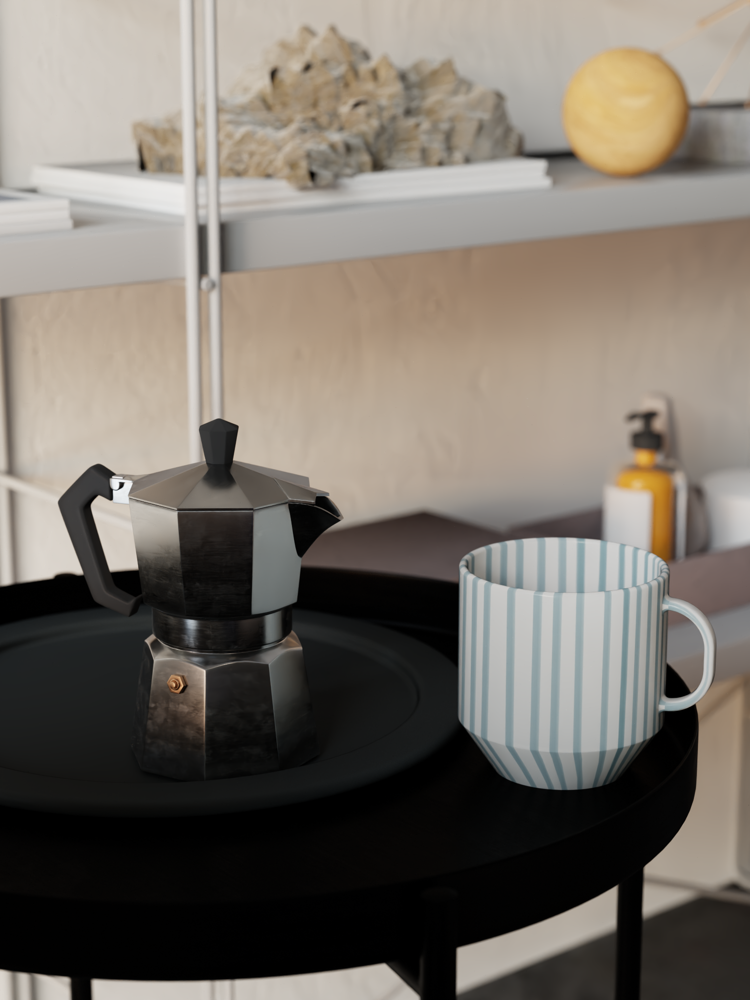 <b>Moka detail</b>

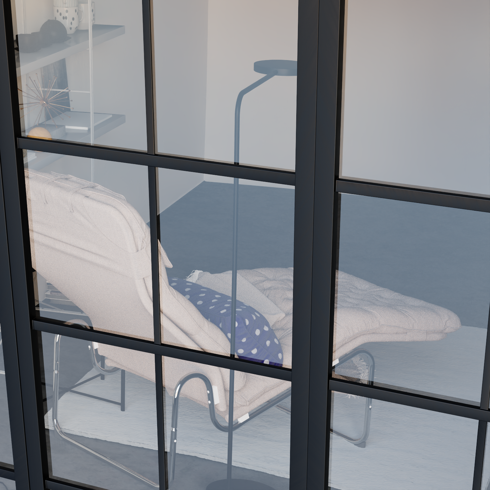 <b>Outside</b>

> Scene: *Kroken* by Angelo Ferretti / Lucy Dreams, licensed
> [CC BY-ND 4.0](https://creativecommons.org/licenses/by-nd/4.0/) — published with
> the author's written permission (see the
> [note](#kroken--noderivatives-permission-granted) below).

---

## Bistro

The Amazon Lumberyard Bistro — a Parisian café exterior and interior under warm
evening light.

 <b>Vespa</b>

 <b>Café</b>

 <b>Le Chevalier</b>

---

## Bathroom

A daylit modern bathroom — reflective tile, chrome fixtures, and soft window
light.

---

## Zero-Day

Neon-lit sci-fi corridor from Beeple's short film — a classic global-illumination
stress test.

---

## Monster Under the Bed

A stylized creature peering out from beneath a bed — a subsurface-scattering
study.

---

## Classroom

The well-known Blender classroom benchmark scene — daylight through the blinds.

---

## Hornet

Character study lit with a single warm key and a looping light-trail, rendered
from a fan-made 3D model. **Unofficial fan art** — see the
[notice](#fan-art-notice-hornet) below.

---

## Staircase

A sunlit wooden staircase — a soft-shadow and indirect-light study.

---

## Credits & licenses

All images here are renders I produced with my own path tracer. The underlying
3D scenes and models were created by the artists credited below and used under
the stated licenses; **each render is a new image derived from those assets.**
Trademarks and characters are the property of their respective owners.

| Render | Scene / model — author | Source | License |
| --- | --- | --- | --- |
| Poolhouse *(heavily modified)* | *Modern luxury villa house building with pool* — zigurat architecture studio | [Sketchfab](https://sketchfab.com/3d-models/modern-luxury-villa-house-building-with-pool-0e858284939343cb994233d40a48a20a) | [CC BY 4.0](https://creativecommons.org/licenses/by/4.0/) |
| Bistro (Café, Vespa, Le Chevalier) | *Amazon Lumberyard Bistro* — Amazon Lumberyard | [NVIDIA ORCA](https://developer.nvidia.com/orca/amazon-lumberyard-bistro) · [pbrt-v4-scenes](https://github.com/mmp/pbrt-v4-scenes) | [CC BY 4.0](https://creativecommons.org/licenses/by/4.0/) |
| Zero-Day | *Zero-Day* — Mike Winkelmann (Beeple) | [beeple-crap.com/resources](https://www.beeple-crap.com/resources) | Free for any use, no attribution required (credited voluntarily) |
| Hornet | *Silksong \|\| Hornet Fanart* — dark_igorek | [Sketchfab](https://sketchfab.com/3d-models/silksong-hornet-fanart-57d431b977c841ef8c117af82f109890) | [CC BY 4.0](https://creativecommons.org/licenses/by/4.0/) |
| Classroom | *Class room* — Christophe Seux | [Blender Demo Files](https://www.blender.org/download/demo-files/) | [CC0 1.0](https://creativecommons.org/publicdomain/zero/1.0/) (public domain; credited voluntarily) |
| Monster Under the Bed | Metin Seven, based on 2D concept art by Blake Stevenson | [Blender Demo Files](https://www.blender.org/download/demo-files/) | [CC BY 4.0](https://creativecommons.org/licenses/by/4.0/) |
| Staircase | *The Wooden Staircase* — Wig42 | [Blend Swap #14449](https://blendswap.com/blend/14449) | [CC BY](https://creativecommons.org/licenses/by/3.0/) |
| Bathroom | *Bathroom Scene 15* — PHI Archviz | [Fab](https://www.fab.com/listings/0a045566-e87c-4c54-927b-b40173523681) | [Fab Standard License](https://www.fab.com/eula) (Personal/Professional; no attribution required, credited voluntarily) |
| Kroken | Angelo Ferretti / Lucy Dreams | [lucydreams.it](https://www.lucydreams.it/kroken/) · [pbrt-v4-scenes](https://github.com/mmp/pbrt-v4-scenes) | [CC BY-ND 4.0](https://creativecommons.org/licenses/by-nd/4.0/) |

### Fan-art notice (Hornet)

The Hornet render is **unofficial fan art**. The character Hornet and *Hollow
Knight: Silksong* are trademarks and/or copyright of **Team Cherry**. This
non-commercial render is not affiliated with, authorized, sponsored, or endorsed
by Team Cherry. The underlying 3D model, *Silksong || Hornet Fanart* by
dark_igorek, is used under [CC BY 4.0](https://creativecommons.org/licenses/by/4.0/).

### Kroken — NoDerivatives, permission granted

The Kroken scene is licensed **CC BY-ND 4.0**, which technically excludes
derivative works such as renders. Angelo Ferretti (Founder & Director, Lucy
Dreams — the scene's author), granted written permission by email on
**2026-07-03** to publish rendered images of the scene in this context,
subject to Lucy Dreams' [shop EULA/license
terms](https://www.lucydreams.it/shop/eula-license/). That email is kept on
file as proof of permission.

### Bathroom — Fab Standard License

The *Bathroom Scene 15* asset by **PHI Archviz** was purchased on
[Fab](https://www.fab.com/listings/0a045566-e87c-4c54-927b-b40173523681) under the
[Fab Standard License](https://www.fab.com/eula). That license grants the right to
use and modify the asset to produce final rendered images ("linear" end products
such as the still shown here) and to display it publicly. It does **not**
require attribution — the author is credited here voluntarily — and it does **not**
permit redistributing the underlying 3D asset files themselves. Only rendered
images are published in this repository, so the license terms are respected.

### Rights holders

Attribution and licenses above are provided in good faith. If you are a rights
holder and have a concern about any asset used here, contact
**drnicolasmenzel@gmail.com** and I will promptly address it.

---

> **Note:** The Staircase entry lists CC BY; confirm the exact CC-BY version
> shown on the [Blend Swap page](https://blendswap.com/blend/14449) and update
> the license link if it differs.

---

## Architecture

The project consists of two tightly coupled but clearly separated
systems:

-   **The Editor** owns authoring.
-   **The Renderer** owns rendering.

The editor never owns compiled rendering state, GPU resources or
rendering algorithms. The renderer never owns authoring concepts.

Everything begins with a single **Document**, which is the only
authoritative representation of the scene. Everything else is derived.

The diagrams below share one colour code:
**🟥 source of truth** · **🟦 on disk** · **🟪 derived, read-only** ·
**🟧 renderer boundary** · **🟩 renderer / GPU**

------------------------------------------------------------------------

## System Overview

The full round trip: a file becomes the Document, the Document fans out into
derived views, one of those views crosses the bridge into the renderer, and the
image comes back to the viewport the user edits from.

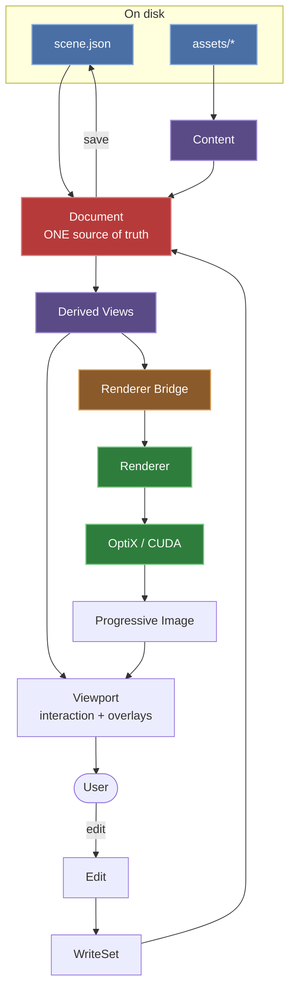
```mermaid
flowchart TD
    subgraph DISK["On disk"]
        SceneFile["scene.json"]
        Assets["assets/*"]
    end

    SceneFile --> Document["Document<br/>ONE source of truth"]
    Assets --> Content["Content"]
    Content --> Document

    Document --> Views["Derived Views"]
    Views --> Viewport["Viewport<br/>interaction + overlays"]
    Views --> Bridge["Renderer Bridge"]

    Bridge --> Renderer["Renderer"]
    Renderer --> GPU["OptiX / CUDA"]
    GPU --> Image["Progressive Image"]
    Image --> Viewport

    Viewport --> User(["User"])
    User -->|"edit"| Edit["Edit"]
    Edit --> WriteSet["WriteSet"]
    WriteSet --> Document
    Document -->|"save"| SceneFile

    classDef disk fill:#4a6fa5,stroke:#8fb0d8,stroke-width:1.5px,color:#fff
    classDef truth fill:#b73a3a,stroke:#e07a7a,stroke-width:1.5px,color:#fff
    classDef view fill:#5a4a86,stroke:#9d8ad0,stroke-width:1.5px,color:#fff
    classDef bridge fill:#8a5a2b,stroke:#d8a05a,stroke-width:1.5px,color:#fff
    classDef gpu fill:#2f7d3c,stroke:#7acb85,stroke-width:1.5px,color:#fff
    class SceneFile,Assets disk
    class Document truth
    class Views,Content view
    class Bridge bridge
    class Renderer,GPU gpu
```

------------------------------------------------------------------------

## Ownership

Who owns what. Nothing flows backwards into the Document except through an
edit, and nothing reaches the renderer except through the bridge.

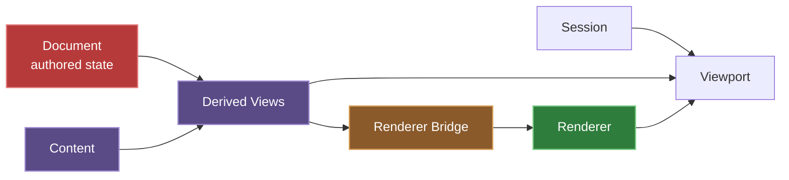
```mermaid
flowchart LR
    Document["Document<br/>authored state"]
    Content["Content"]
    Session["Session"]
    Views["Derived Views"]
    Bridge["Renderer Bridge"]
    Renderer["Renderer"]
    Viewport["Viewport"]

    Document --> Views
    Content --> Views
    Views --> Bridge
    Bridge --> Renderer

    Session --> Viewport
    Views --> Viewport
    Renderer --> Viewport

    classDef truth fill:#b73a3a,stroke:#e07a7a,stroke-width:1.5px,color:#fff
    classDef view fill:#5a4a86,stroke:#9d8ad0,stroke-width:1.5px,color:#fff
    classDef bridge fill:#8a5a2b,stroke:#d8a05a,stroke-width:1.5px,color:#fff
    classDef gpu fill:#2f7d3c,stroke:#7acb85,stroke-width:1.5px,color:#fff
    class Document truth
    class Views,Content view
    class Bridge bridge
    class Renderer gpu
```

------------------------------------------------------------------------

## Edit Pipeline

One edit, one path. The epoch bump is what tells the derived views they are
stale — no view polls the Document.

```mermaid
flowchart LR
    User(["User"]) --> Edit["Edit"] --> WriteSet["WriteSet"] --> Document["Document"]
    Document --> SceneEpoch["SceneEpoch"] --> Views["Derived Views"]

    Views --> Viewport["Viewport"]
    Views --> Bridge["Renderer Bridge"] --> Renderer["Renderer"]
    Renderer --> Image["Progressive Image"] --> Viewport

    classDef truth fill:#b73a3a,stroke:#e07a7a,stroke-width:1.5px,color:#fff
    classDef view fill:#5a4a86,stroke:#9d8ad0,stroke-width:1.5px,color:#fff
    classDef bridge fill:#8a5a2b,stroke:#d8a05a,stroke-width:1.5px,color:#fff
    classDef gpu fill:#2f7d3c,stroke:#7acb85,stroke-width:1.5px,color:#fff
    class Document,SceneEpoch truth
    class Views view
    class Bridge bridge
    class Renderer,Image gpu
```

------------------------------------------------------------------------

## Derived Views

Every view derives from the Document — they are siblings, not a chain, and none
of them feeds another. Five drive the UI, one drives the viewport, and exactly
one crosses into the renderer.

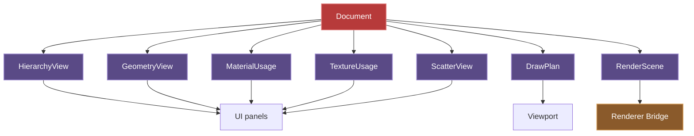
```mermaid
flowchart TD
    Document["Document"]

    Document --> HierarchyView["HierarchyView"]
    Document --> GeometryView["GeometryView"]
    Document --> MaterialUsage["MaterialUsage"]
    Document --> TextureUsage["TextureUsage"]
    Document --> ScatterView["ScatterView"]
    Document --> DrawPlan["DrawPlan"]
    Document --> RenderScene["RenderScene"]

    HierarchyView --> UI["UI panels"]
    GeometryView --> UI
    MaterialUsage --> UI
    TextureUsage --> UI
    ScatterView --> UI

    DrawPlan --> Viewport["Viewport"]
    RenderScene --> Bridge["Renderer Bridge"]

    classDef truth fill:#b73a3a,stroke:#e07a7a,stroke-width:1.5px,color:#fff
    classDef view fill:#5a4a86,stroke:#9d8ad0,stroke-width:1.5px,color:#fff
    classDef bridge fill:#8a5a2b,stroke:#d8a05a,stroke-width:1.5px,color:#fff
    class Document truth
    class HierarchyView,GeometryView,MaterialUsage,TextureUsage,ScatterView,DrawPlan,RenderScene view
    class Bridge bridge
```

------------------------------------------------------------------------

## Renderer Boundary

The bridge is the only door. Left of it everything is authoring; right of it
nothing knows what a Document is.

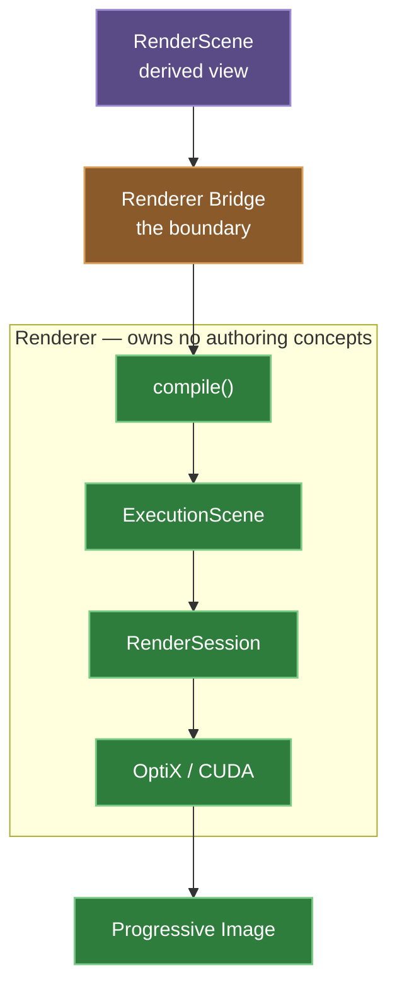
```mermaid
flowchart TD
    RenderScene["RenderScene<br/>derived view"]
    Bridge["Renderer Bridge<br/>the boundary"]

    subgraph RENDER["Renderer — owns no authoring concepts"]
        Compile["compile()"]
        ExecutionScene["ExecutionScene"]
        RenderSession["RenderSession"]
        GPU["OptiX / CUDA"]
    end

    RenderScene --> Bridge --> Compile --> ExecutionScene
    ExecutionScene --> RenderSession --> GPU
    GPU --> ProgressiveImage["Progressive Image"]

    classDef view fill:#5a4a86,stroke:#9d8ad0,stroke-width:1.5px,color:#fff
    classDef bridge fill:#8a5a2b,stroke:#d8a05a,stroke-width:1.5px,color:#fff
    classDef gpu fill:#2f7d3c,stroke:#7acb85,stroke-width:1.5px,color:#fff
    class RenderScene view
    class Bridge bridge
    class Compile,ExecutionScene,RenderSession,GPU,ProgressiveImage gpu
```

------------------------------------------------------------------------

## Viewport

Two sources composite into one image: realtime OpenGL for everything you
interact with, and the path-traced result underneath it.

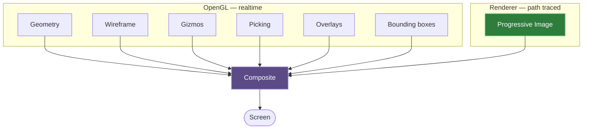
```mermaid
flowchart TD
    subgraph GL["OpenGL — realtime"]
        Geometry["Geometry"]
        Wireframe["Wireframe"]
        Gizmos["Gizmos"]
        Picking["Picking"]
        Overlays["Overlays"]
        BoundingBoxes["Bounding boxes"]
    end

    subgraph RT["Renderer — path traced"]
        ProgressiveImage["Progressive Image"]
    end

    Geometry --> Composite["Composite"]
    Wireframe --> Composite
    Gizmos --> Composite
    Picking --> Composite
    Overlays --> Composite
    BoundingBoxes --> Composite
    ProgressiveImage --> Composite

    Composite --> Screen(["Screen"])

    classDef gpu fill:#2f7d3c,stroke:#7acb85,stroke-width:1.5px,color:#fff
    classDef view fill:#5a4a86,stroke:#9d8ad0,stroke-width:1.5px,color:#fff
    class ProgressiveImage gpu
    class Composite view
```

------------------------------------------------------------------------

## Filesystem

A project is a directory and nothing else — no registry, no index. `scene.json`
is the authored file; everything else beside it is either input or output.

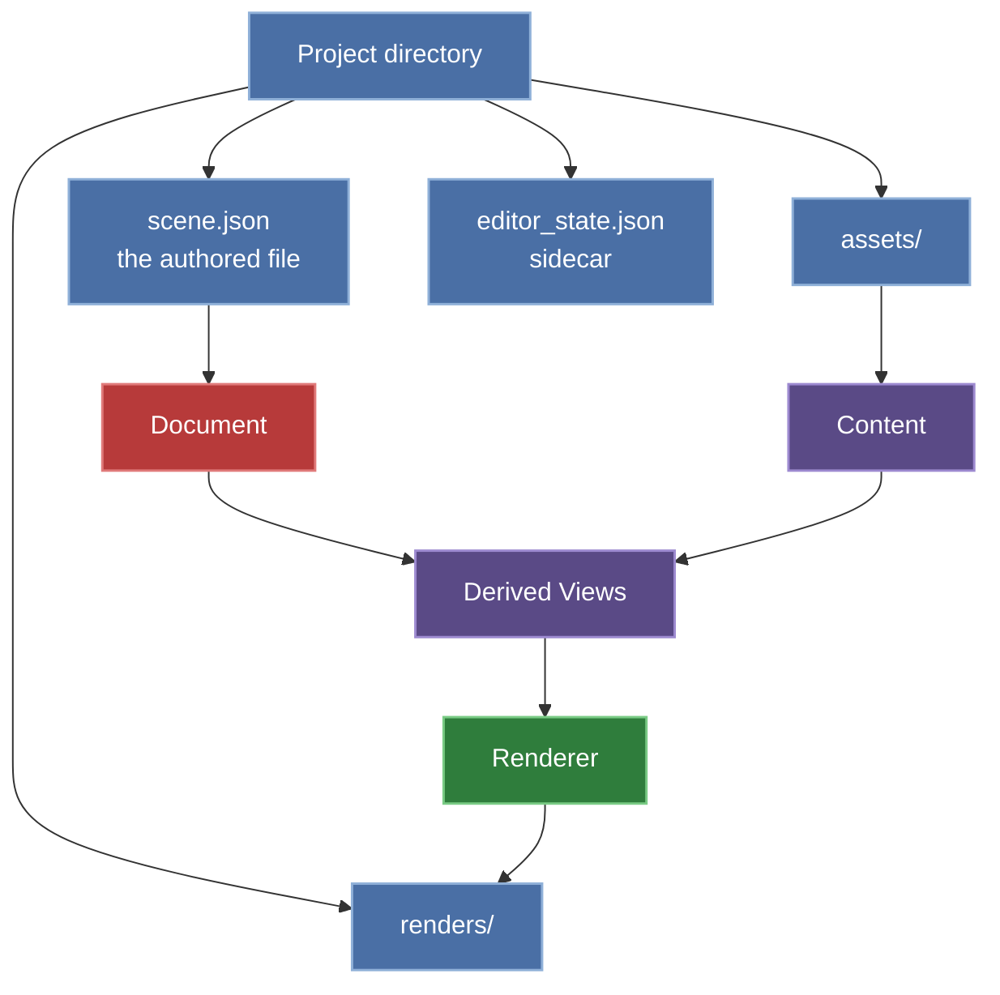
```mermaid
flowchart TD
    Project["Project directory"]

    Project --> SceneJson["scene.json<br/>the authored file"]
    Project --> AssetsDir["assets/"]
    Project --> EditorState["editor_state.json<br/>sidecar"]
    Project --> RendersDir["renders/"]

    SceneJson --> Document["Document"]
    AssetsDir --> Content["Content"]
    Document --> Views["Derived Views"]
    Content --> Views
    Views --> Renderer["Renderer"]
    Renderer --> RendersDir

    classDef disk fill:#4a6fa5,stroke:#8fb0d8,stroke-width:1.5px,color:#fff
    classDef truth fill:#b73a3a,stroke:#e07a7a,stroke-width:1.5px,color:#fff
    classDef view fill:#5a4a86,stroke:#9d8ad0,stroke-width:1.5px,color:#fff
    classDef gpu fill:#2f7d3c,stroke:#7acb85,stroke-width:1.5px,color:#fff
    class Project,SceneJson,AssetsDir,EditorState,RendersDir disk
    class Document truth
    class Views,Content view
    class Renderer gpu
```

------------------------------------------------------------------------

## Layering

Dependencies point one way only, and the direction *is* the architecture: each
layer chooses *what*, the layer below chooses *how*. Nothing below reaches up.

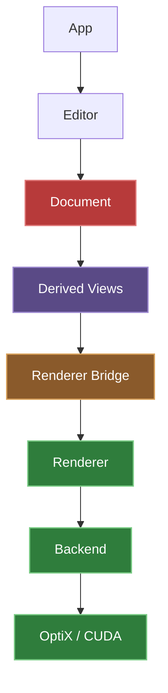
```mermaid
flowchart TD
    App["App"] --> Editor["Editor"]
    Editor --> Document["Document"]
    Document --> Views["Derived Views"]
    Views --> RendererBridge["Renderer Bridge"]
    RendererBridge --> Renderer["Renderer"]
    Renderer --> Backend["Backend"]
    Backend --> GPU["OptiX / CUDA"]

    classDef truth fill:#b73a3a,stroke:#e07a7a,stroke-width:1.5px,color:#fff
    classDef view fill:#5a4a86,stroke:#9d8ad0,stroke-width:1.5px,color:#fff
    classDef bridge fill:#8a5a2b,stroke:#d8a05a,stroke-width:1.5px,color:#fff
    classDef gpu fill:#2f7d3c,stroke:#7acb85,stroke-width:1.5px,color:#fff
    class Document truth
    class Views view
    class RendererBridge bridge
    class Renderer,Backend,GPU gpu
```

------------------------------------------------------------------------

## Renderer Target Architecture

One line, one direction. Each stage owns exactly one thing, and the two stages
that own memory own *all* of it.

```mermaid
flowchart LR
    Document["SceneDocument"]
    Compile["compile()"]
    RenderInput["RenderInput<br/>immutable<br/>4 versioned blocks"]
    DeviceScene["DeviceScene<br/>sole owner of<br/>scene GPU memory"]
    Integrator["Integrator<br/>pure rendering algorithms"]
    Film["Film<br/>sole owner of pixel memory"]
    Resolve["resolve()"]
    Image["Image"]

    Document --> Compile --> RenderInput --> DeviceScene
    DeviceScene --> Integrator --> Film --> Resolve --> Image

    classDef truth fill:#b73a3a,stroke:#e07a7a,stroke-width:1.5px,color:#fff
    classDef bridge fill:#8a5a2b,stroke:#d8a05a,stroke-width:1.5px,color:#fff
    classDef gpu fill:#2f7d3c,stroke:#7acb85,stroke-width:1.5px,color:#fff
    class Document truth
    class Compile,Resolve bridge
    class RenderInput,DeviceScene,Integrator,Film gpu
```

------------------------------------------------------------------------

## Renderer Ownership & Lifetime

The edge labels are the whole contract: everything crossing into the renderer
crosses as an immutable snapshot, and the integrator only ever reads.

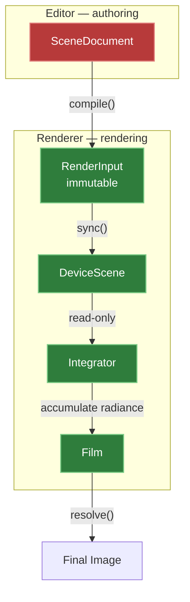
```mermaid
flowchart TD
    subgraph EDITOR["Editor — authoring"]
        Document["SceneDocument"]
    end

    subgraph RENDERER["Renderer — rendering"]
        RenderInput["RenderInput<br/>immutable"]
        DeviceScene["DeviceScene"]
        Integrator["Integrator"]
        Film["Film"]
    end

    Document -->|"compile()"| RenderInput
    RenderInput -->|"sync()"| DeviceScene
    DeviceScene -->|"read-only"| Integrator
    Integrator -->|"accumulate radiance"| Film
    Film -->|"resolve()"| Image["Final Image"]

    classDef truth fill:#b73a3a,stroke:#e07a7a,stroke-width:1.5px,color:#fff
    classDef gpu fill:#2f7d3c,stroke:#7acb85,stroke-width:1.5px,color:#fff
    class Document truth
    class RenderInput,DeviceScene,Integrator,Film gpu
```

------------------------------------------------------------------------

## Renderer Data Flow

The same data, narrowing at every step: an authored scene becomes a compiled
block, a GPU mirror, then per-ray state a few registers wide.

```mermaid
flowchart LR
    A["Authored Scene"]
    B["Compile"]
    C["Compiled RenderInput"]
    D["GPU Mirror<br/>DeviceScene"]
    E["LaunchParams"]
    F["Thin Payload"]
    G["TransportState"]
    H["Film"]
    I["Resolved Image"]

    A --> B --> C --> D --> E
    E --> F --> G --> H --> I

    classDef truth fill:#b73a3a,stroke:#e07a7a,stroke-width:1.5px,color:#fff
    classDef bridge fill:#8a5a2b,stroke:#d8a05a,stroke-width:1.5px,color:#fff
    classDef gpu fill:#2f7d3c,stroke:#7acb85,stroke-width:1.5px,color:#fff
    class A truth
    class B bridge
    class C,D,E,F,G,H gpu
```

------------------------------------------------------------------------

## Memory Ownership

Red marks the two allocations that are actually owned; everything between them
is scratch that exists only for the length of a launch.

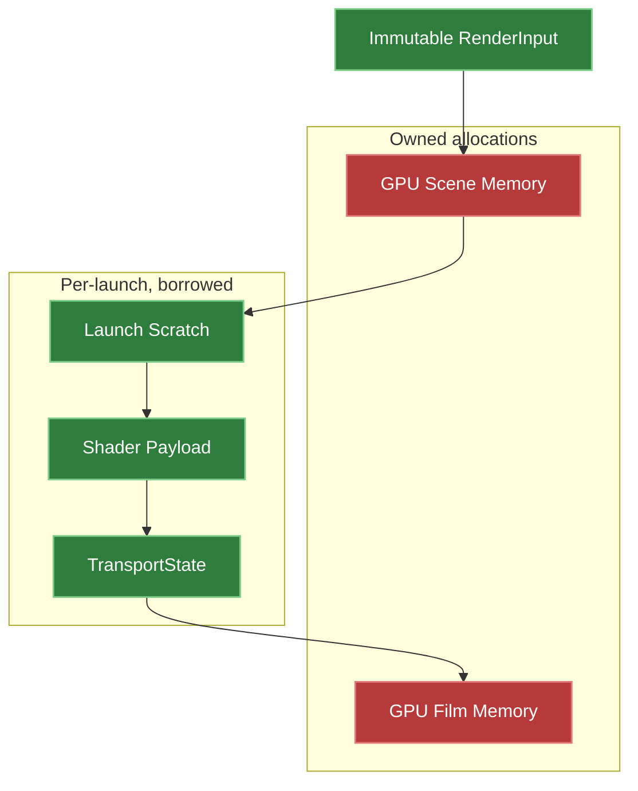
```mermaid
flowchart TD
    RenderInput["Immutable RenderInput"]

    subgraph OWNED["Owned allocations"]
        DeviceScene["GPU Scene Memory"]
        Film["GPU Film Memory"]
    end

    subgraph BORROWED["Per-launch, borrowed"]
        Scratch["Launch Scratch"]
        Payload["Shader Payload"]
        Transport["TransportState"]
    end

    RenderInput --> DeviceScene
    DeviceScene --> Scratch
    Scratch --> Payload
    Payload --> Transport
    Transport --> Film

    classDef truth fill:#b73a3a,stroke:#e07a7a,stroke-width:1.5px,color:#fff
    classDef gpu fill:#2f7d3c,stroke:#7acb85,stroke-width:1.5px,color:#fff
    class DeviceScene,Film truth
    class RenderInput,Scratch,Payload,Transport gpu
```
