# Portfolio — Path-Traced Renders

Hero renders produced with my own, self-written path tracers. This repo doubles
as a small gallery site.

**Click any image to open it at full resolution.**

---

## Contents

**[Editor](#editor)** — the path tracer behind every image below

**Renders** —
[Poolhouse](#poolhouse) ·
[Kroken](#kroken) ·
[Bistro](#bistro) ·
[Zero-Day](#zero-day) ·
[Bathroom](#bathroom) ·
[Monster Under the Bed](#monster-under-the-bed) ·
[Classroom](#classroom) ·
[Gelatinous Cube](#gelatinous-cube) ·
[4060.b Spaceship](#4060b-spaceship) ·
[Hornet](#hornet) ·
[Staircase](#staircase)

**[Credits &amp; licenses](#credits--licenses)** —
[Fan-art notice (Hornet)](#fan-art-notice-hornet) ·
[Fan-art notice (Gelatinous Cube)](#fan-art-notice-gelatinous-cube) ·
[Kroken — NoDerivatives](#kroken--noderivatives-permission-granted) ·
[Bathroom — Fab Standard License](#bathroom--fab-standard-license) ·
[Rights holders](#rights-holders)

---

## Editor

Every render here comes out of a path tracer I wrote from scratch — scene
management, physically based materials, importance sampling and light transport,
all my own code. Below are shots of its editor: scene tree, layered material
inspector, live viewport, and progressive render output.

---

<table>
  <tr>
    <td width="50%" align="center"></td>
    <td width="50%" align="center"></td>
  </tr>
</table>

---

## Poolhouse

A modern villa and pool — **heavily reworked by me** from a Sketchfab base model,
relit and re-dressed for a set of cinematic hero shots.

<table>
  <tr>
    <td width="50%" align="center"> <b>Hero — grass</b></td>
    <td width="50%" align="center"> <b>Hero — terrace</b></td>
  </tr>
  <tr>
    <td width="50%" align="center"> <b>Hero — interior</b></td>
    <td width="50%" align="center"> <b>Cinematic grade</b></td>
  </tr>
</table>

> Base model: *\*Modern luxury villa house building with pool\** by zigurat
> architecture studio, licensed
> [CC BY 4.0](https\://creativecommons.org/licenses/by/4.0/) and heavily modified
> here (geometry, materials, lighting, staging). CC BY permits modification with
> attribution and an indication of changes.

---

## Kroken

A modern interior-design scene — a Kroken easy chair and chaise longue beside a
styled shelving wall.

<table>
  <tr>
    <td width="50%" align="center"><a href="images/06_kroken/Camera_01_Main_001.png">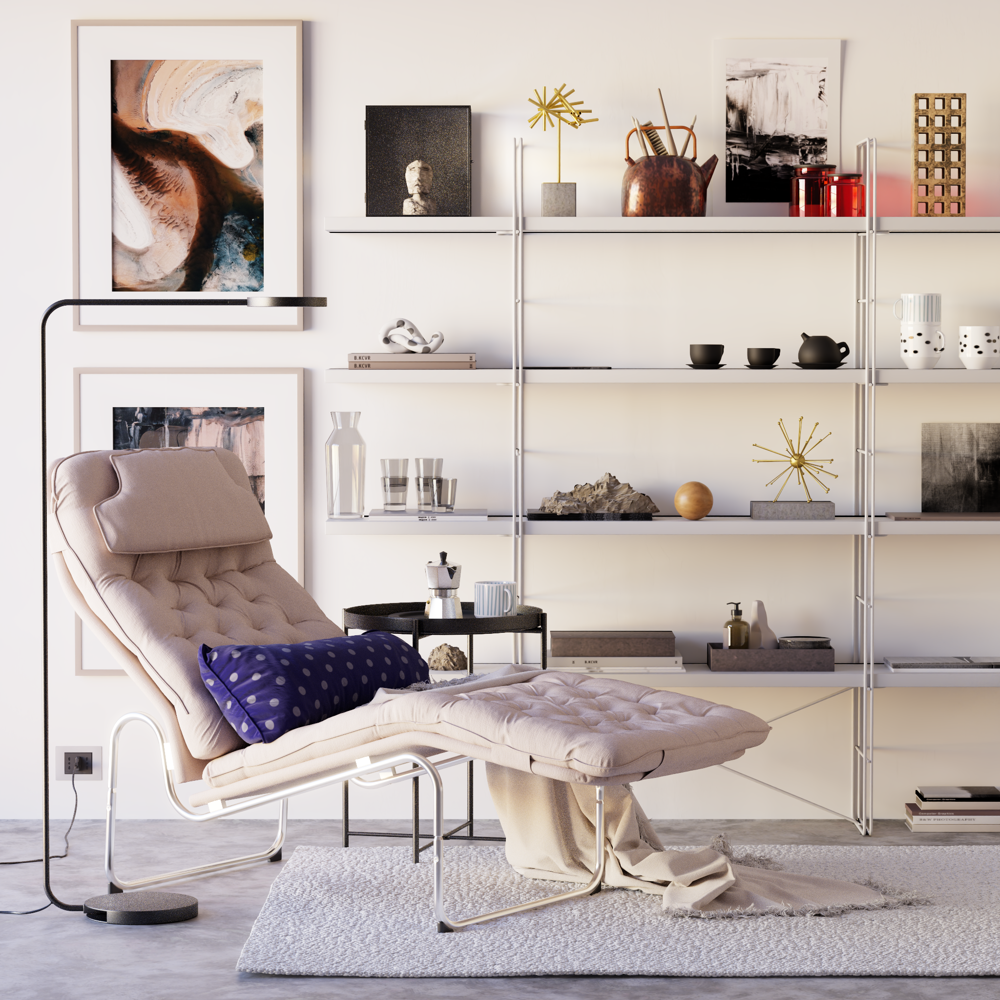</a> <b>Main</b></td>
    <td width="50%" align="center"><a href="images/06_kroken/Camera_01b_Main_Clay.png">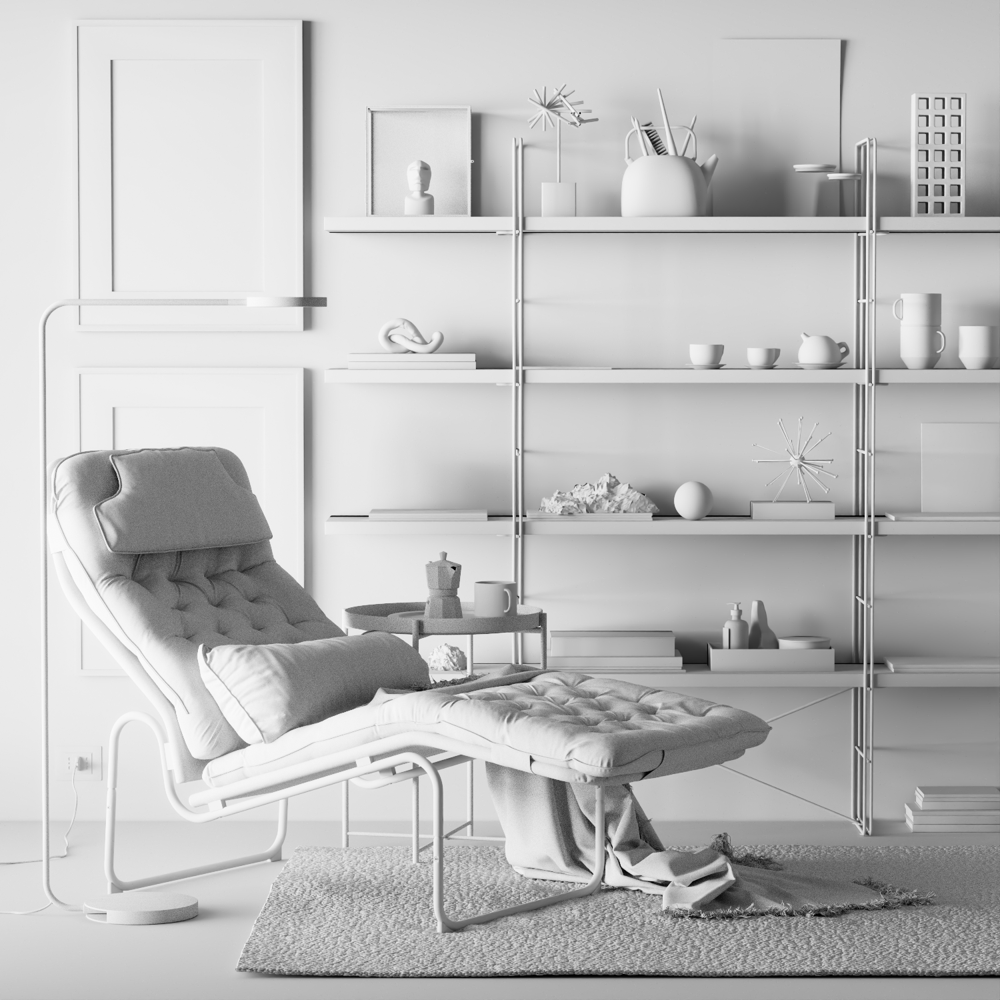</a> <b>Clay render</b></td>
  </tr>
  <tr>
    <td width="50%" align="center"><a href="images/06_kroken/Camera_02_Chaise_Longue_001.png">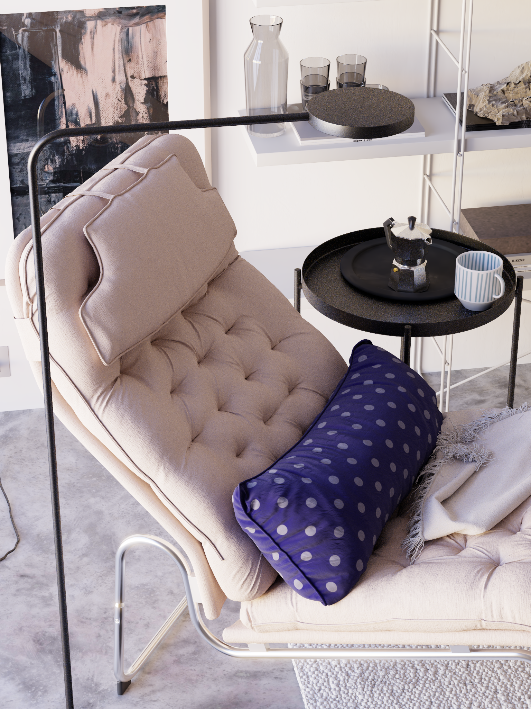</a> <b>Chaise longue</b></td>
    <td width="50%" align="center"><a href="images/06_kroken/Camera_03_Shelf_001.png">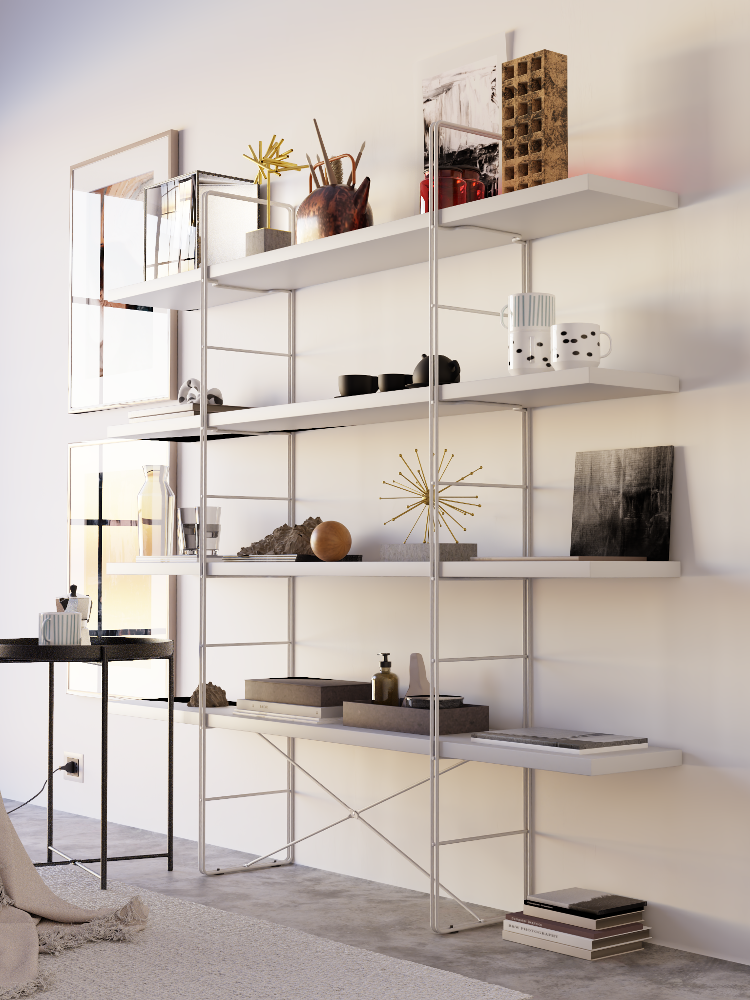</a> <b>Shelf</b></td>
  </tr>
  <tr>
    <td width="50%" align="center"><a href="images/06_kroken/Camera_04_Shelf_Detail_001.png">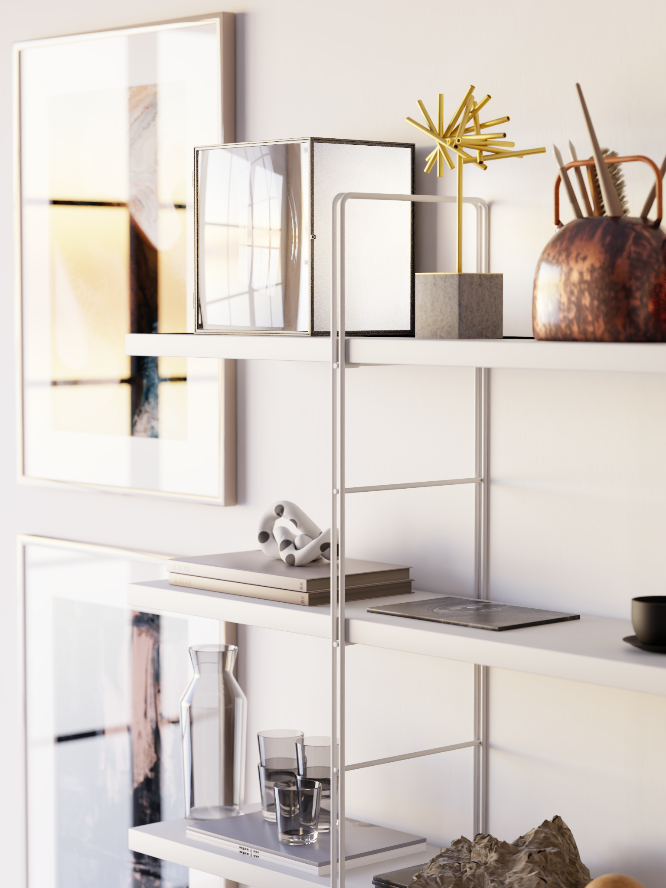</a> <b>Shelf detail</b></td>
    <td width="50%" align="center"><a href="images/06_kroken/Camera_05_Blanket_Detail_Top_001.png">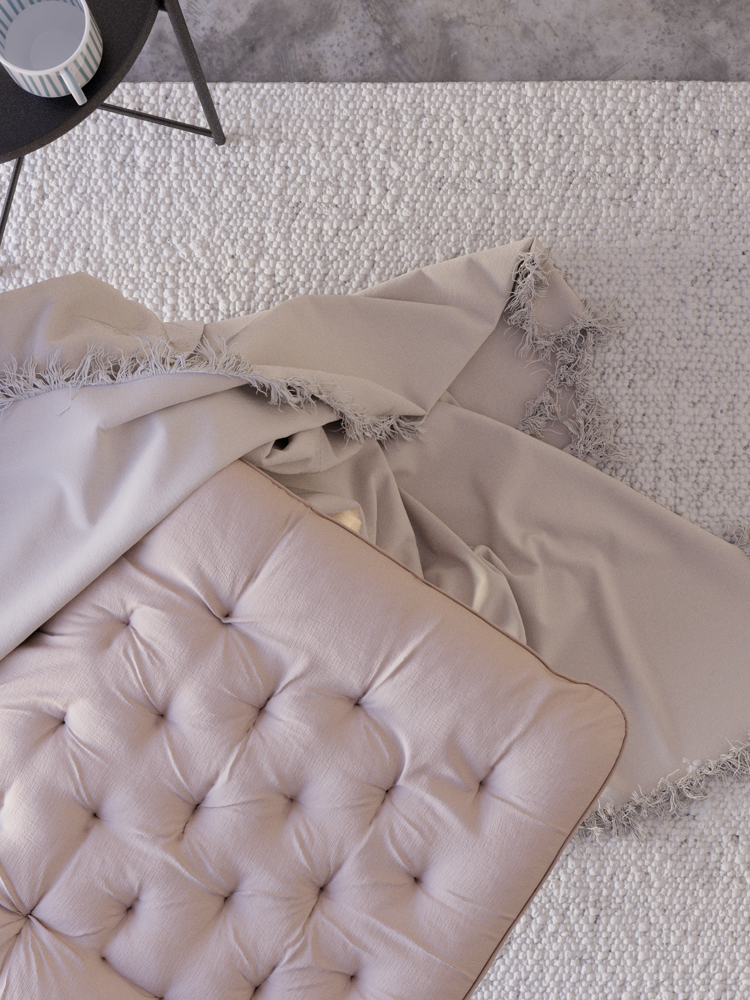</a> <b>Blanket detail — top</b></td>
  </tr>
  <tr>
    <td width="50%" align="center"><a href="images/06_kroken/Camera_06_Blanket_Detail_Front_001.png">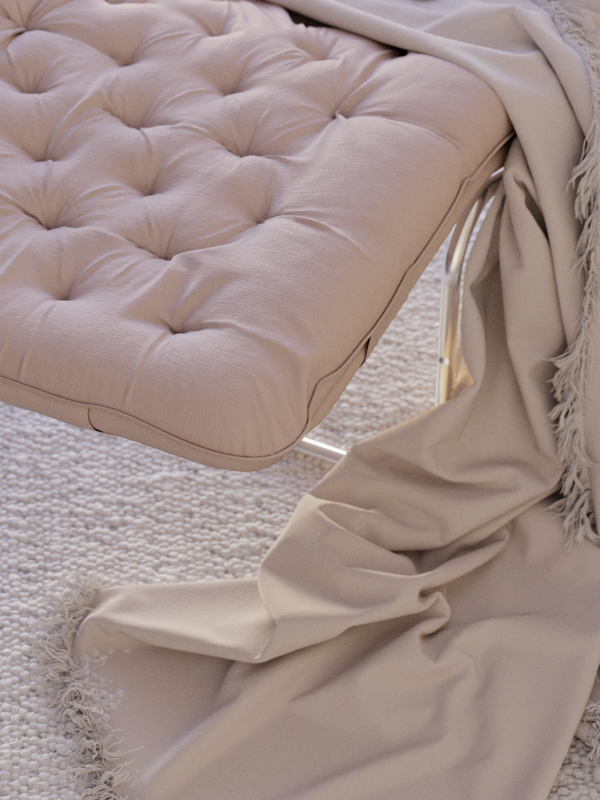</a> <b>Blanket detail — front</b></td>
    <td width="50%" align="center"><a href="images/06_kroken/Camera_07_Moka_Detail_001.png">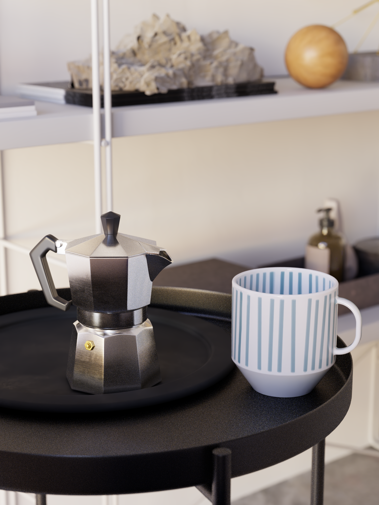</a> <b>Moka detail</b></td>
  </tr>
</table>

> Scene: *\*Kroken\** by Angelo Ferretti / Lucy Dreams, licensed
> [CC BY-ND 4.0](https\://creativecommons.org/licenses/by-nd/4.0/) — published with
> the author's written permission (see the
> [note](#kroken--noderivatives-permission-granted) below).

---

## Bistro

The Amazon Lumberyard Bistro — a Parisian café exterior and interior under warm
evening light.

<table>
  <tr>
    <td width="50%" align="center"> <b>Vespa</b></td>
    <td width="50%" align="center"> <b>Café</b></td>
  </tr>
  <tr>
    <td width="50%" align="center"> <b>Le Chevalier</b></td>
    <td width="50%" align="center"><a href="images/07_bistro/04_clay.png">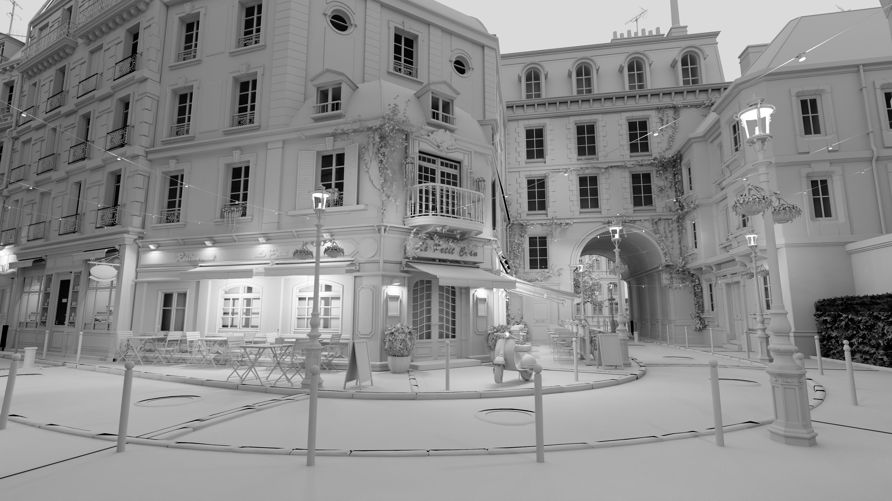</a> <b>Clay render</b></td>
  </tr>
</table>

---

## Zero-Day

Neon-lit sci-fi corridor from Beeple's short film — a classic global-illumination
stress test.

<table>
  <tr>
    <td width="50%" align="center"></td>
    <td width="50%" align="center"></td>
  </tr>
</table>

---

## Bathroom

A daylit modern bathroom — reflective tile, chrome fixtures, and soft window
light.

<table>
  <tr>
    <td width="50%" align="center"><a href="images/09_bathroom/bathroom.png">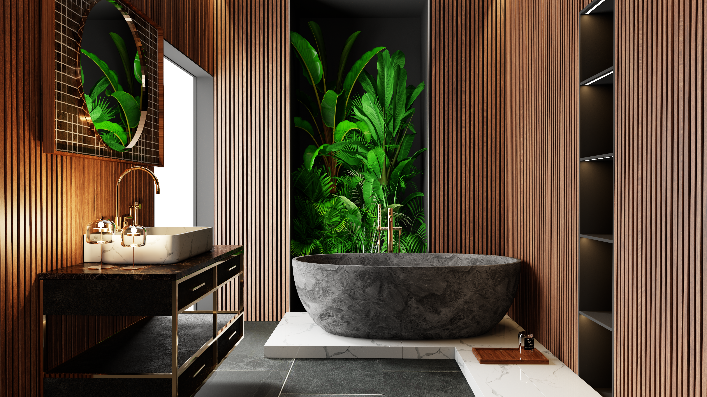</a></td>
    <td width="50%"></td>
  </tr>
</table>

---

## Monster Under the Bed

A stylized creature peering out from beneath a bed — a subsurface-scattering
study.

<table>
  <tr>
    <td width="50%" align="center"></td>
    <td width="50%"></td>
  </tr>
</table>

---

## Classroom

The well-known Blender classroom benchmark scene — daylight through the blinds.

<table>
  <tr>
    <td width="50%" align="center"></td>
    <td width="50%"></td>
  </tr>
</table>

---

## Gelatinous Cube

A translucent ooze settled in a vine-grown stone ruin, a helmeted skeleton with
its sword, shield and a few spent arrows suspended mid-digestion inside — a
study in refraction, absorption and volumetric scattering. The clay pass drops
the jelly and shows what is trapped in it. **Unofficial fan art** — see the
[notice](#fan-art-notice-gelatinous-cube) below.

<table>
  <tr>
    <td width="50%" align="center"><a href="images/12_gelatinous_cube/main.png">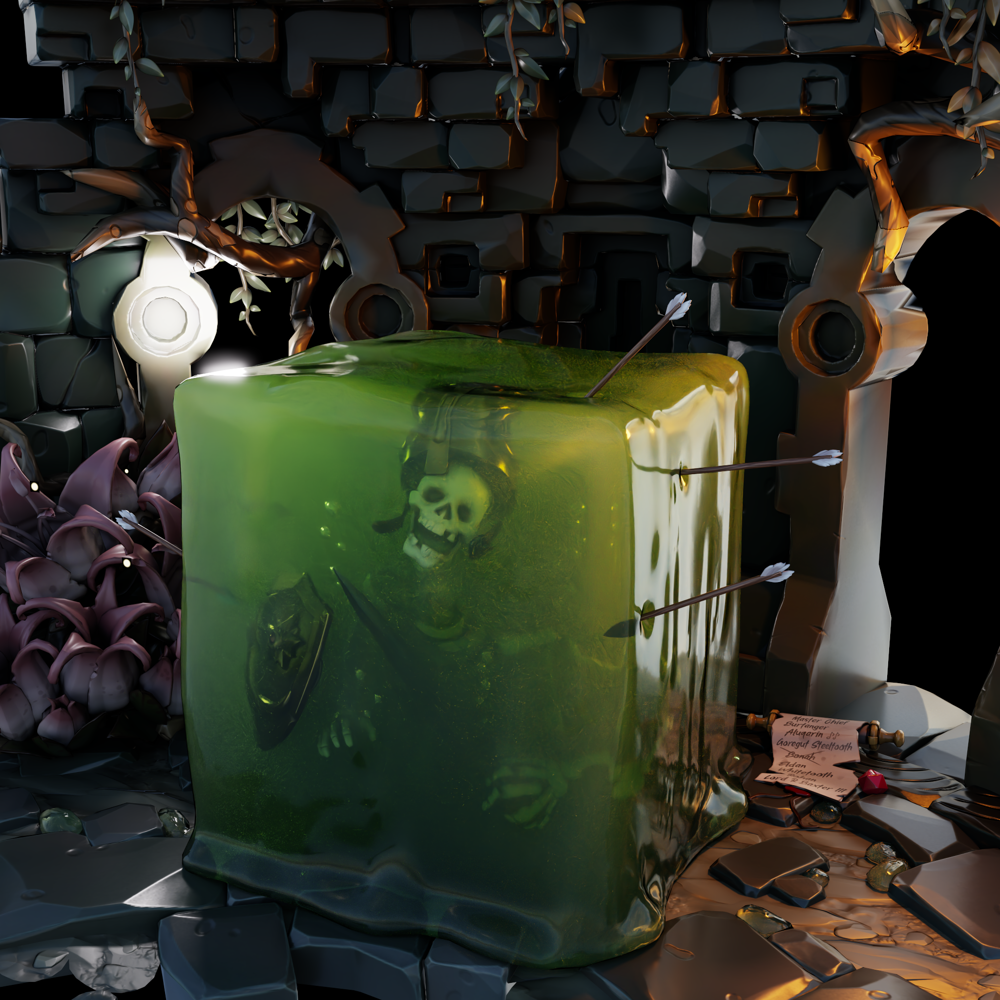</a> <b>Main</b></td>
    <td width="50%" align="center"><a href="images/12_gelatinous_cube/clay.png">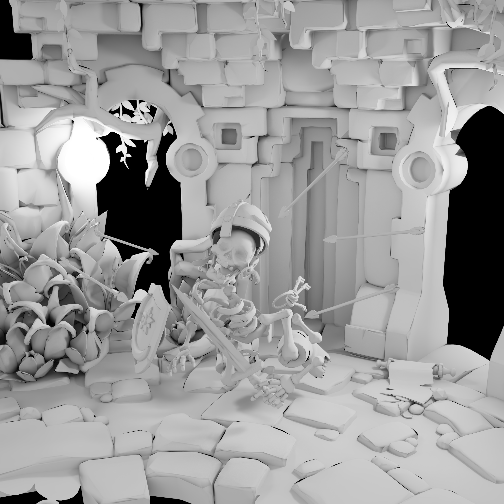</a> <b>Clay render</b></td>
  </tr>
</table>

---

## 4060.b Spaceship

A retro-futurist rocket in 1960s science-fiction styling — polished chrome, a
glass bubble canopy over magenta seats, and ribbed thrusters, lit on a plain
studio backdrop.

<table>
  <tr>
    <td width="50%" align="center"><a href="images/13_spaceship/main.png">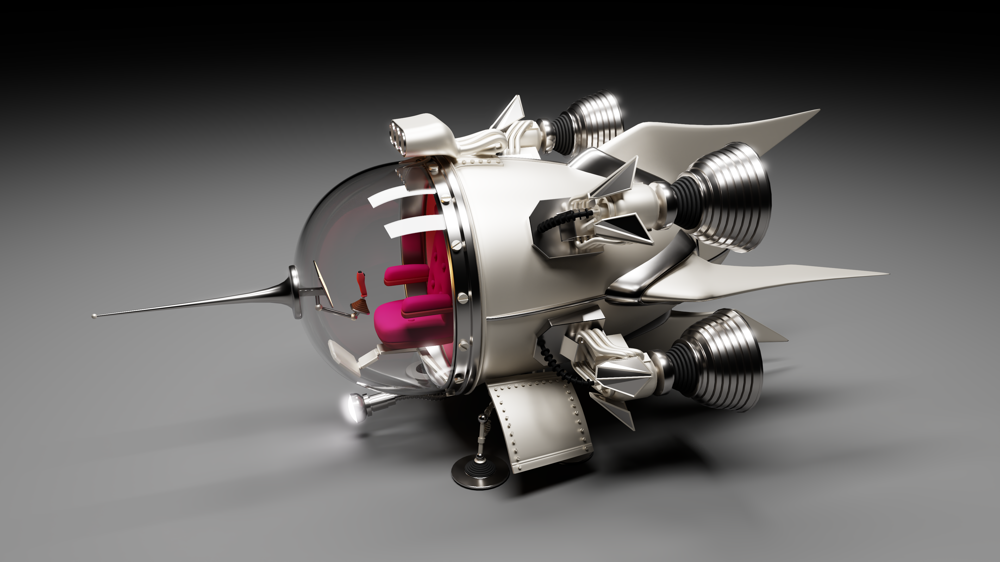</a> <b>Main</b></td>
    <td width="50%" align="center"><a href="images/13_spaceship/clay.png">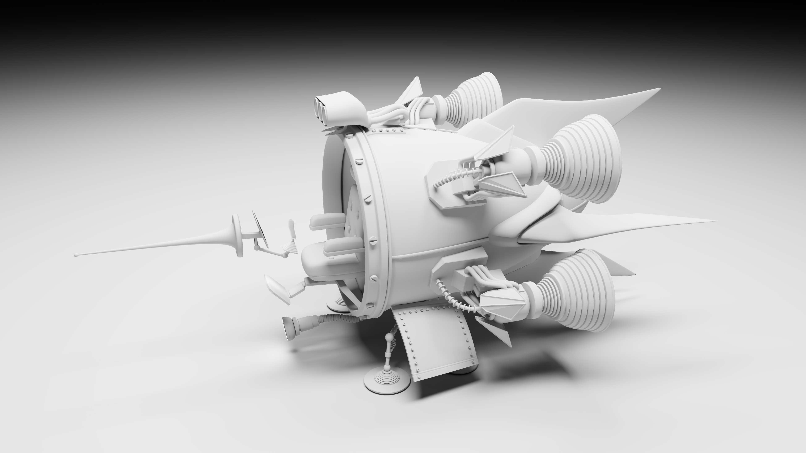</a> <b>Clay render</b></td>
  </tr>
</table>

---

## Hornet

Character study lit with a single warm key and a looping light-trail, rendered
from a fan-made 3D model. **Unofficial fan art** — see the
[notice](#fan-art-notice-hornet) below.

<table>
  <tr>
    <td width="50%" align="center"></td>
    <td width="50%"></td>
  </tr>
</table>

---

## Staircase

A sunlit wooden staircase — a soft-shadow and indirect-light study.

<table>
  <tr>
    <td width="50%" align="center"></td>
    <td width="50%"></td>
  </tr>
</table>

---

## Credits & licenses

All images here are renders I produced with my own path tracer. The underlying
3D scenes and models were created by the artists credited below and used under
the stated licenses; **each render is a new image derived from those assets.**
Trademarks and characters are the property of their respective owners.

| Render | Scene / model — author | Source | License |
| --- | --- | --- | --- |
| Poolhouse *\*(heavily modified)\** | *\*Modern luxury villa house building with pool\** — zigurat architecture studio | [Sketchfab](https\://sketchfab.com/3d-models/modern-luxury-villa-house-building-with-pool-0e858284939343cb994233d40a48a20a) | [CC BY 4.0](https\://creativecommons.org/licenses/by/4.0/) |
| Bistro (Café, Vespa, Le Chevalier) | *\*Amazon Lumberyard Bistro\** — Amazon Lumberyard | [NVIDIA ORCA](https\://developer.nvidia.com/orca/amazon-lumberyard-bistro) · [pbrt-v4-scenes](https\://github.com/mmp/pbrt-v4-scenes) | [CC BY 4.0](https\://creativecommons.org/licenses/by/4.0/) |
| Zero-Day | *\*Zero-Day\** — Mike Winkelmann (Beeple) | [beeple-crap.com/resources](https\://www.beeple-crap.com/resources) | Free for any use, no attribution required (credited voluntarily) |
| Hornet | *\*Silksong \|\| Hornet Fanart\** — dark_igorek | [Sketchfab](https\://sketchfab.com/3d-models/silksong-hornet-fanart-57d431b977c841ef8c117af82f109890) | [CC BY 4.0](https\://creativecommons.org/licenses/by/4.0/) |
| Gelatinous Cube | *\*Gelatinous Cube\** — glenatron | [Sketchfab](https\://sketchfab.com/3d-models/gelatinous-cube-e08385238f4d4b59b012233a9fbdca21) | [CC BY-NC 4.0](https\://creativecommons.org/licenses/by-nc/4.0/) (attribution required; non-commercial use only) |
| 4060.b Spaceship | *\*4060.b Spaceship\** — thecali | [Blend Swap #13489](https\://blendswap.com/blend/13489) | [CC0 1.0](https\://creativecommons.org/publicdomain/zero/1.0/) (public domain; credited voluntarily) |
| Classroom | *\*Class room\** — Christophe Seux | [Blender Demo Files](https\://www.blender.org/download/demo-files/) | [CC0 1.0](https\://creativecommons.org/publicdomain/zero/1.0/) (public domain; credited voluntarily) |
| Monster Under the Bed | Metin Seven, based on 2D concept art by Blake Stevenson | [Blender Demo Files](https\://www.blender.org/download/demo-files/) | [CC BY 4.0](https\://creativecommons.org/licenses/by/4.0/) |
| Staircase | *\*The Wooden Staircase\** — Wig42 | [Blend Swap #14449](https\://blendswap.com/blend/14449) | [CC BY](https\://creativecommons.org/licenses/by/3.0/) |
| Bathroom | *\*Bathroom Scene 15\** — PHI Archviz | [Fab](https\://www.fab.com/listings/0a045566-e87c-4c54-927b-b40173523681) | [Fab Standard License](https\://www.fab.com/eula) (Personal/Professional; no attribution required, credited voluntarily) |
| Kroken | Angelo Ferretti / Lucy Dreams | [lucydreams.it](https\://www.lucydreams.it/kroken/) · [pbrt-v4-scenes](https\://github.com/mmp/pbrt-v4-scenes) | [CC BY-ND 4.0](https\://creativecommons.org/licenses/by-nd/4.0/) |

### Fan-art notice (Hornet)

The Hornet render is **unofficial fan art**. The character Hornet and \*Hollow
Knight: Silksong\* are trademarks and/or copyright of **Team Cherry**. This
non-commercial render is not affiliated with, authorized, sponsored, or endorsed
by Team Cherry. The underlying 3D model, *\*Silksong \|\| Hornet Fanart\** by
dark_igorek, is used under [CC BY 4.0](https\://creativecommons.org/licenses/by/4.0/).

### Fan-art notice (Gelatinous Cube)

The Gelatinous Cube render is **unofficial fan art**. The gelatinous cube is a
\*Dungeons & Dragons\* monster; D&D and its trade dress are trademarks of
**Wizards of the Coast**, and this render is not affiliated with, authorized,
sponsored, or endorsed by them. (The creature's game statistics appear in the
[CC BY 4.0](https\://creativecommons.org/licenses/by/4.0/)-licensed SRD 5.1, but
that covers the rules text, not this artwork.)

The underlying 3D model, *\*Gelatinous Cube\** by **glenatron**, is licensed
[CC BY-NC 4.0](https\://creativecommons.org/licenses/by-nc/4.0/). Attribution is
given above, and the **NonCommercial** term is respected: this site carries no
advertising, sells nothing, and the renders are neither licensed nor offered for
sale. Should this portfolio ever be monetized, this render must be pulled or
separate permission obtained from the author.

### Kroken — NoDerivatives, permission granted

The Kroken scene is licensed **CC BY-ND 4.0**, which technically excludes
derivative works such as renders. Angelo Ferretti (Founder & Director, Lucy
Dreams — the scene's author), granted written permission by email on
**2026-07-03** to publish rendered images of the scene in this context,
subject to Lucy Dreams' [shop EULA/license
terms](https\://www.lucydreams.it/shop/eula-license/). That email is kept on
file as proof of permission.

### Bathroom — Fab Standard License

The *\*Bathroom Scene 15\** asset by **PHI Archviz** was purchased on
[Fab](https\://www.fab.com/listings/0a045566-e87c-4c54-927b-b40173523681) under the
[Fab Standard License](https\://www.fab.com/eula). That license grants the right to
use and modify the asset to produce final rendered images ("linear" end products
such as the still shown here) and to display it publicly. It does **not**
require attribution — the author is credited here voluntarily — and it does **not**
permit redistributing the underlying 3D asset files themselves. Only rendered
images are published in this repository, so the license terms are respected.

### Rights holders

Attribution and licenses above are provided in good faith. If you are a rights
holder and have a concern about any asset used here, contact
**drnicolasmenzel@gmail.com** and I will promptly address it.

---

> **Note:** The Staircase entry lists CC BY; confirm the exact CC-BY version
> shown on the [Blend Swap page](https\://blendswap.com/blend/14449) and update
> the license link if it differs.

---
