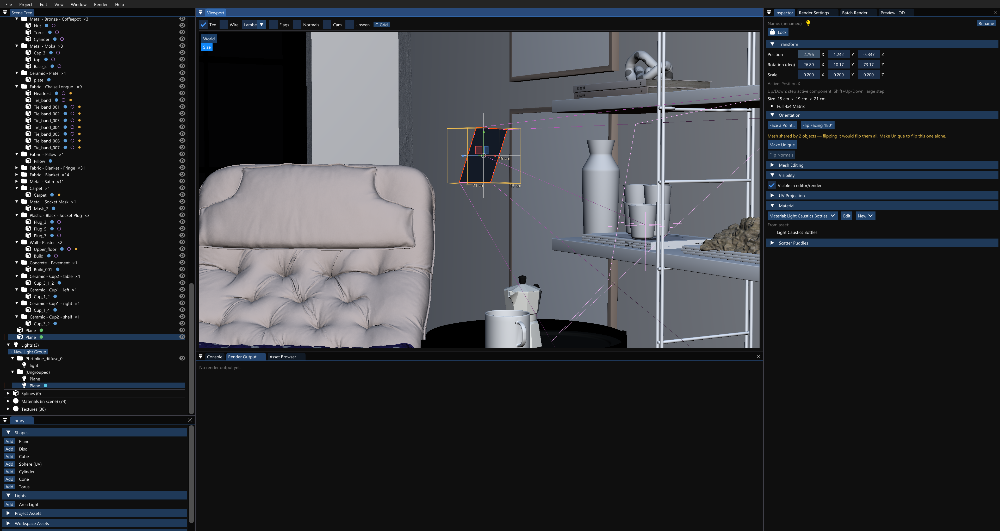
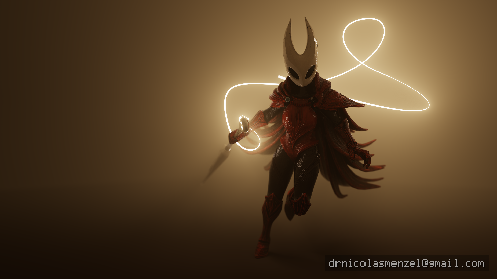
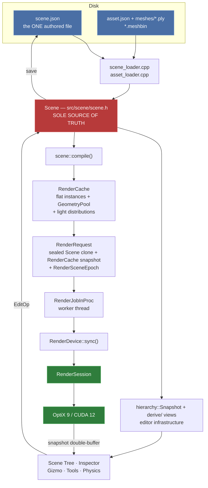
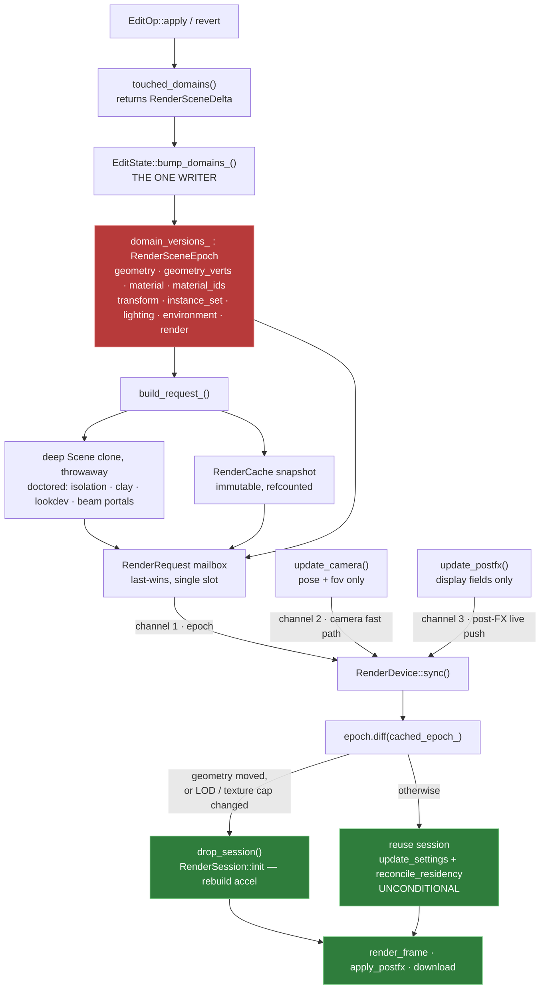
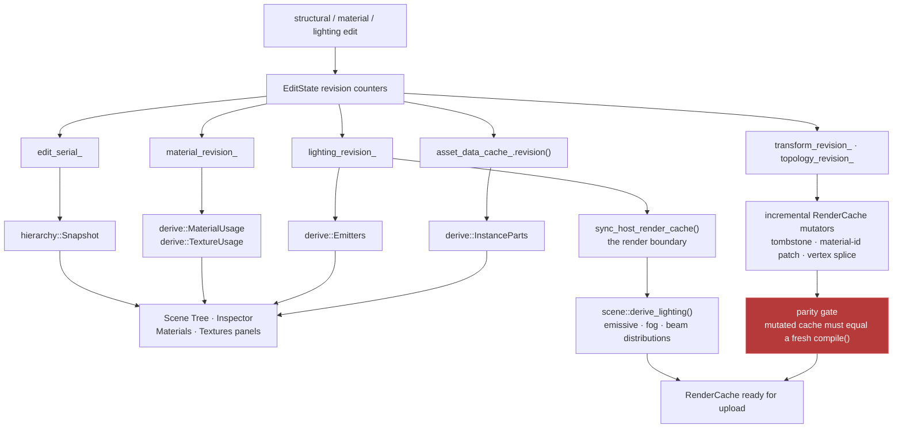
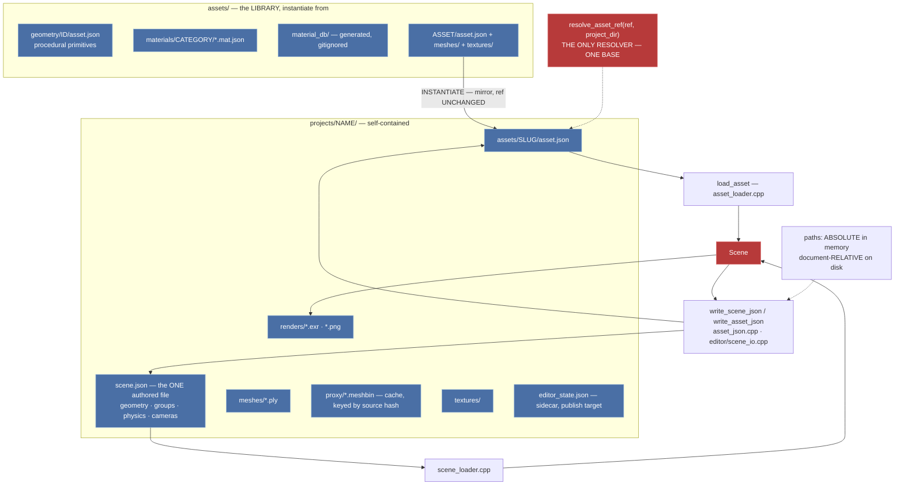
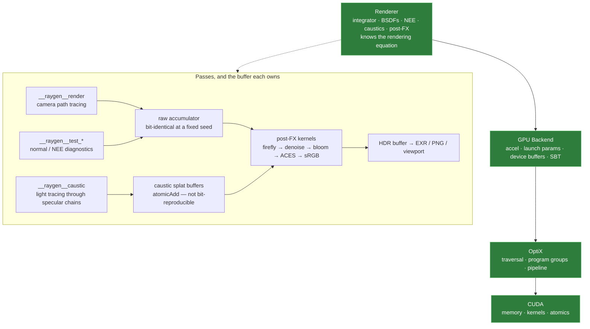

# Portfolio — Path-Traced Renders

Hero renders produced with my own, self-written path tracers. This repo doubles
as a small gallery site.

---

## Gallery

<table>
  <tr>
    <td width="33%" align="center"> <b>The editor</b></td>
    <td width="33%" align="center"> <b>Kroken</b></td>
    <td width="33%" align="center"> <b>Bistro</b></td>
  </tr>
  <tr>
    <td width="33%" align="center"> <b>Bathroom</b></td>
    <td width="33%" align="center"> <b>Zero-Day</b></td>
    <td width="33%" align="center"> <b>Monster Under the Bed</b></td>
  </tr>
  <tr>
    <td width="33%" align="center"> <b>Classroom</b></td>
    <td width="33%" align="center"> <b>Hornet</b></td>
    <td width="33%" align="center"> <b>Staircase</b></td>
  </tr>
</table>

---

## Editor

Every render here comes out of a path tracer I wrote from scratch — scene
management, physically based materials, importance sampling and light transport,
all my own code. Below are shots of its editor: scene tree, layered material
inspector, live viewport, and progressive render output.

---

## Kroken

A modern interior-design scene — a Kroken easy chair and chaise longue beside a
styled shelving wall.

 <b>Main</b>

 <b>Main — black &amp; white</b>

 <b>Shelf detail</b>

 <b>Moka detail</b>

> Scene: *Kroken* by Angelo Ferretti / Lucy Dreams, licensed
> [CC BY-ND 4.0](https://creativecommons.org/licenses/by-nd/4.0/) — published with
> the author's written permission (see the
> [note](#kroken--noderivatives-permission-granted) below).

---

## Bistro

The Amazon Lumberyard Bistro — a Parisian café exterior and interior under warm
evening light.

 <b>Vespa</b>

 <b>Café</b>

 <b>Le Chevalier</b>

---

## Bathroom

A daylit modern bathroom — reflective tile, chrome fixtures, and soft window
light.

---

## Zero-Day

Neon-lit sci-fi corridor from Beeple's short film — a classic global-illumination
stress test.

---

## Monster Under the Bed

A stylized creature peering out from beneath a bed — a subsurface-scattering
study.

---

## Classroom

The well-known Blender classroom benchmark scene — daylight through the blinds.

---

## Hornet

Character study lit with a single warm key and a looping light-trail, rendered
from a fan-made 3D model. **Unofficial fan art** — see the
[notice](#fan-art-notice-hornet) below.

---

## Staircase

A sunlit wooden staircase — a soft-shadow and indirect-light study.

---

## Credits & licenses

All images here are renders I produced with my own path tracer. The underlying
3D scenes and models were created by the artists credited below and used under
the stated licenses; **each render is a new image derived from those assets.**
Trademarks and characters are the property of their respective owners.

| Render | Scene / model — author | Source | License |
| --- | --- | --- | --- |
| Bistro (Café, Vespa, Le Chevalier) | *Amazon Lumberyard Bistro* — Amazon Lumberyard | [NVIDIA ORCA](https://developer.nvidia.com/orca/amazon-lumberyard-bistro) · [pbrt-v4-scenes](https://github.com/mmp/pbrt-v4-scenes) | [CC BY 4.0](https://creativecommons.org/licenses/by/4.0/) |
| Zero-Day | *Zero-Day* — Mike Winkelmann (Beeple) | [beeple-crap.com/resources](https://www.beeple-crap.com/resources) | Free for any use, no attribution required (credited voluntarily) |
| Hornet | *Silksong \|\| Hornet Fanart* — dark_igorek | [Sketchfab](https://sketchfab.com/3d-models/silksong-hornet-fanart-57d431b977c841ef8c117af82f109890) | [CC BY 4.0](https://creativecommons.org/licenses/by/4.0/) |
| Classroom | *Class room* — Christophe Seux | [Blender Demo Files](https://www.blender.org/download/demo-files/) | [CC0 1.0](https://creativecommons.org/publicdomain/zero/1.0/) (public domain; credited voluntarily) |
| Monster Under the Bed | Metin Seven, based on 2D concept art by Blake Stevenson | [Blender Demo Files](https://www.blender.org/download/demo-files/) | [CC BY 4.0](https://creativecommons.org/licenses/by/4.0/) |
| Staircase | *The Wooden Staircase* — Wig42 | [Blend Swap #14449](https://blendswap.com/blend/14449) | [CC BY](https://creativecommons.org/licenses/by/3.0/) |
| Bathroom | *Bathroom Scene 15* — PHI Archviz | [Fab](https://www.fab.com/listings/0a045566-e87c-4c54-927b-b40173523681) | [Fab Standard License](https://www.fab.com/eula) (Personal/Professional; no attribution required, credited voluntarily) |
| Kroken | Angelo Ferretti / Lucy Dreams | [lucydreams.it](https://www.lucydreams.it/kroken/) · [pbrt-v4-scenes](https://github.com/mmp/pbrt-v4-scenes) | [CC BY-ND 4.0](https://creativecommons.org/licenses/by-nd/4.0/) |

### Fan-art notice (Hornet)

The Hornet render is **unofficial fan art**. The character Hornet and *Hollow
Knight: Silksong* are trademarks and/or copyright of **Team Cherry**. This
non-commercial render is not affiliated with, authorized, sponsored, or endorsed
by Team Cherry. The underlying 3D model, *Silksong || Hornet Fanart* by
dark_igorek, is used under [CC BY 4.0](https://creativecommons.org/licenses/by/4.0/).

### Kroken — NoDerivatives, permission granted

The Kroken scene is licensed **CC BY-ND 4.0**, which technically excludes
derivative works such as renders. Angelo Ferretti (Founder & Director, Lucy
Dreams — the scene's author), granted written permission by email on
**2026-07-03** to publish rendered images of the scene in this context,
subject to Lucy Dreams' [shop EULA/license
terms](https://www.lucydreams.it/shop/eula-license/). That email is kept on
file as proof of permission.

### Bathroom — Fab Standard License

The *Bathroom Scene 15* asset by **PHI Archviz** was purchased on
[Fab](https://www.fab.com/listings/0a045566-e87c-4c54-927b-b40173523681) under the
[Fab Standard License](https://www.fab.com/eula). That license grants the right to
use and modify the asset to produce final rendered images ("linear" end products
such as the still shown here) and to display it publicly. It does **not**
require attribution — the author is credited here voluntarily — and it does **not**
permit redistributing the underlying 3D asset files themselves. Only rendered
images are published in this repository, so the license terms are respected.

### Rights holders

Attribution and licenses above are provided in good faith. If you are a rights
holder and have a concern about any asset used here, contact
**drnicolasmenzel@gmail.com** and I will promptly address it.

---

> **Note:** The Staircase entry lists CC BY; confirm the exact CC-BY version
> shown on the [Blend Swap page](https://blendswap.com/blend/14449) and update
> the license link if it differs.

---

## Architecture

The project is one binary with two faces: an interactive scene editor and a GPU path tracer, both
reading and writing the **same** runtime `Scene`. There is no editor scene graph, no exporter, and
no translation layer between the two — the editor's undo stack and the renderer's device buffers
are both derived from a single authored file.

The five diagrams below are the top-down map: the system, the synchronization system, dirtiness,
the file system, and the inside of the renderer.

### System map

One runtime `Scene` is the hub. Two derived views hang off it and they are orthogonal — neither
consumes the other: an authoring index for the editor, a compiled cache for the renderer.
Everything that crosses to the GPU crosses as a sealed, immutable snapshot.

```mermaid
flowchart TD
  subgraph DISK["Disk"]
    SJ["scene.json<br/>the ONE authored file"]
    AJ["asset.json + meshes/*.ply<br/>*.meshbin"]
  end

  SJ --> LOAD["scene_loader.cpp<br/>asset_loader.cpp"]
  AJ --> LOAD
  LOAD --> SCENE["Scene — src/scene/scene.h<br/>SOLE SOURCE OF TRUTH"]

  SCENE --> HIER["hierarchy::Snapshot + derive/ views<br/>editor infrastructure"]
  SCENE --> COMPILE["scene::compile()"]

  HIER --> UI["Scene Tree · Inspector<br/>Gizmo · Tools · Physics"]
  COMPILE --> RC["RenderCache<br/>flat instances + GeometryPool<br/>+ light distributions"]

  UI -->|"EditOp"| SCENE
  RC --> REQ["RenderRequest<br/>sealed Scene clone + RenderCache snapshot<br/>+ RenderSceneEpoch"]
  REQ --> JOB["RenderJobInProc<br/>worker thread"]
  JOB --> DEV["RenderDevice::sync()"]
  DEV --> SESS["RenderSession"]
  SESS --> GPU["OptiX 9 / CUDA 12"]
  GPU -->|"snapshot double-buffer"| UI
  SCENE -->|"save"| SJ

  classDef disk fill:#4a6fa5,stroke:#8fb0d8,color:#fff
  classDef truth fill:#b73a3a,stroke:#e07a7a,color:#fff
  classDef gpu fill:#2f7d3c,stroke:#7acb85,color:#fff
  class SJ,AJ,MJ disk
  class SCENE truth
  class SESS,GPU gpu
```

### The synchronization system — epochs and the three channels

Every edit is an `EditOp`, and each op declares which render domains it touched. Nine monotonic
counters live in one struct on the editor side; the renderer keeps its own mirror and diffs the
two. Only **three** channels reach the GPU; anything else is an architecture violation.

```mermaid
flowchart TD
  OP["EditOp::apply / revert"] --> DOMAINS["touched_domains()<br/>returns RenderSceneDelta"]
  DOMAINS --> BUMP["EditState::bump_domains_()<br/>THE ONE WRITER"]
  BUMP --> DV["domain_versions_ : RenderSceneEpoch<br/>geometry · geometry_verts · material · material_ids<br/>transform · instance_set · lighting · environment · render"]

  DV --> BR["build_request_()"]
  BR --> CLONE["deep Scene clone, throwaway<br/>doctored: isolation · clay · lookdev · beam portals"]
  BR --> SNAP["RenderCache snapshot<br/>immutable, refcounted"]
  CLONE --> MAIL
  SNAP --> MAIL
  DV --> MAIL["RenderRequest mailbox<br/>last-wins, single slot"]

  MAIL -->|"channel 1 · epoch"| SYNC["RenderDevice::sync()"]
  CAM["update_camera()<br/>pose + fov only"] -->|"channel 2 · camera fast path"| SYNC
  PFX["update_postfx()<br/>display fields only"] -->|"channel 3 · post-FX live push"| SYNC

  SYNC --> DIFF["epoch.diff(cached_epoch_)"]
  DIFF -->|"geometry moved,<br/>or LOD / texture cap changed"| INIT["drop_session()<br/>RenderSession::init — rebuild accel"]
  DIFF -->|"otherwise"| REUSE["reuse session<br/>update_settings + reconcile_residency<br/>UNCONDITIONAL"]
  INIT --> DRAW["render_frame · apply_postfx · download"]
  REUSE --> DRAW

  classDef truth fill:#b73a3a,stroke:#e07a7a,color:#fff
  classDef gpu fill:#2f7d3c,stroke:#7acb85,color:#fff
  class DV truth
  class INIT,REUSE,DRAW gpu
```

GPU state is split by **lifetime**, which is the whole explanation of why a scene change is cheap:
device-lifetime state (`OptixEngine`, the texture pool) survives it; session-lifetime state
(accel structures, framebuffers, environment) dies with the geometry. The worker that delivers
frames owns no GPU state at all.

### Dirtiness — revisions and their consumers

A scene-scale fact that two or more subsystems display is derived **once**, by the model, behind
the narrowest revision that can invalidate it — never by each view, per frame. Setting
`PPT_VALIDATE_DERIVED=1` re-derives on every access, so a missed bump surfaces as a named error
instead of a panel that silently stops updating.

```mermaid
flowchart TD
  EDIT["structural / material / lighting edit"] --> RV["EditState revision counters"]

  RV --> R1["edit_serial_"]
  RV --> R2["material_revision_"]
  RV --> R3["lighting_revision_"]
  RV --> R4["asset_data_cache_.revision()"]
  RV --> R5["transform_revision_ · topology_revision_"]

  R1 --> V1["hierarchy::Snapshot"]
  R2 --> V2["derive::MaterialUsage<br/>derive::TextureUsage"]
  R3 --> V3["derive::Emitters"]
  R4 --> V4["derive::InstanceParts"]

  V1 --> PANEL["Scene Tree · Inspector<br/>Materials · Textures panels"]
  V2 --> PANEL
  V3 --> PANEL
  V4 --> PANEL

  R3 --> HOST["sync_host_render_cache()<br/>the render boundary"]
  HOST --> DL["scene::derive_lighting()<br/>emissive · fog · beam distributions"]
  R5 --> STRUCT["incremental RenderCache mutators<br/>tombstone · material-id patch · vertex splice"]
  STRUCT --> PARITY["parity gate<br/>mutated cache must equal a fresh compile()"]
  DL --> RCOUT["RenderCache ready for upload"]
  PARITY --> RCOUT

  classDef truth fill:#b73a3a,stroke:#e07a7a,color:#fff
  class PARITY truth
```

The compiled cache is mutated in place rather than recompiled on every edit **only** because a
check proves the mutated cache equals a fresh `compile()`. A mutator that cannot satisfy that
check must recompile.

### The file system — library, project, codecs

An asset **is** the directory holding its `asset.json` — no UUID, no registry, no index. A ref
resolves against the project directory or it is absolute, which makes a project self-contained by
construction. The app-level `assets/` tree is a library you *instantiate from*, never a base you
resolve against. Every document is a codec: one writer, one reader, a round-trip test.

```mermaid
flowchart TD
  subgraph LIB["assets/ — the LIBRARY, instantiate from"]
    L1["geometry/ID/asset.json<br/>procedural primitives"]
    L2["materials/CATEGORY/*.mat.json"]
    L3["material_db/ — generated, gitignored"]
    L4["ASSET/asset.json + meshes/ + textures/"]
  end

  subgraph PRJ["projects/NAME/ — self-contained"]
    P1["scene.json — the ONE authored file<br/>geometry · groups · physics · cameras"]
    P2["assets/SLUG/asset.json"]
    P3["meshes/*.ply"]
    P4["proxy/*.meshbin — cache, keyed by source hash"]
    P5["textures/"]
    P6["editor_state.json — sidecar, publish target"]
    P7["renders/*.exr · *.png"]
  end

  L4 -->|"INSTANTIATE — mirror, ref UNCHANGED"| P2
  P1 --> RD["scene_loader.cpp"]
  P2 --> RD2["load_asset — asset_loader.cpp"]
  RD --> SCENE["Scene"]
  RD2 --> SCENE
  SCENE --> WR["write_scene_json / write_asset_json<br/>asset_json.cpp · editor/scene_io.cpp"]
  WR --> P1
  WR --> P2
  SCENE --> P7

  RESOLVE["resolve_asset_ref(ref, project_dir)<br/>THE ONLY RESOLVER — ONE BASE"]
  RESOLVE -.-> P2
  PATHS["paths: ABSOLUTE in memory<br/>document-RELATIVE on disk"]
  PATHS -.-> WR

  classDef disk fill:#4a6fa5,stroke:#8fb0d8,color:#fff
  classDef truth fill:#b73a3a,stroke:#e07a7a,color:#fff
  class P1,P2,P3,P4,P5,P6,P7,L1,L2,L3,L4 disk
  class SCENE,RESOLVE truth
```

### Inside the renderer — four layers, four buffers

Dependencies point one way only, and the direction *is* the architecture: the Renderer layer
chooses *what* to compute, each layer below chooses *how* to run it on this hardware. CUDA never
drives renderer architecture. Four raygen entry points own four distinct buffers, and only the
camera pass is bit-reproducible at a fixed seed — the caustic splat uses `atomicAdd`, so it has a
measurement floor of about 5e-7 by construction.

```mermaid
flowchart TD
  R["Renderer<br/>integrator · BSDFs · NEE · caustics · post-FX<br/>knows the rendering equation"]
  B["GPU Backend<br/>accel · launch params · device buffers · SBT"]
  O["OptiX<br/>traversal · program groups · pipeline"]
  C["CUDA<br/>memory · kernels · atomics"]
  R --> B --> O --> C

  subgraph PASSES["Passes, and the buffer each owns"]
    P1["__raygen__render<br/>camera path tracing"] --> A1["raw accumulator<br/>bit-identical at a fixed seed"]
    P2["__raygen__caustic<br/>light tracing through specular chains"] --> A2["caustic splat buffers<br/>atomicAdd — not bit-reproducible"]
    P3["__raygen__test_*<br/>normal / NEE diagnostics"] --> A1
    A1 --> PF["post-FX kernels<br/>firefly → denoise → bloom → ACES → sRGB"]
    A2 --> PF
    PF --> HDR["HDR buffer → EXR / PNG / viewport"]
  end

  R -.-> PASSES

  classDef gpu fill:#2f7d3c,stroke:#7acb85,color:#fff
  class R,B,O,C gpu
```